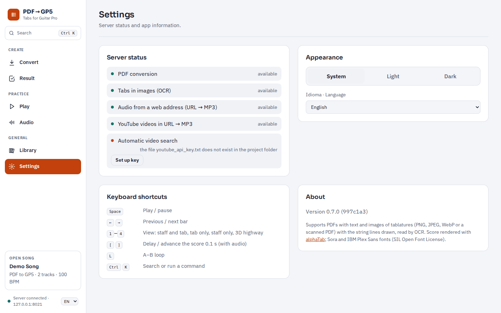
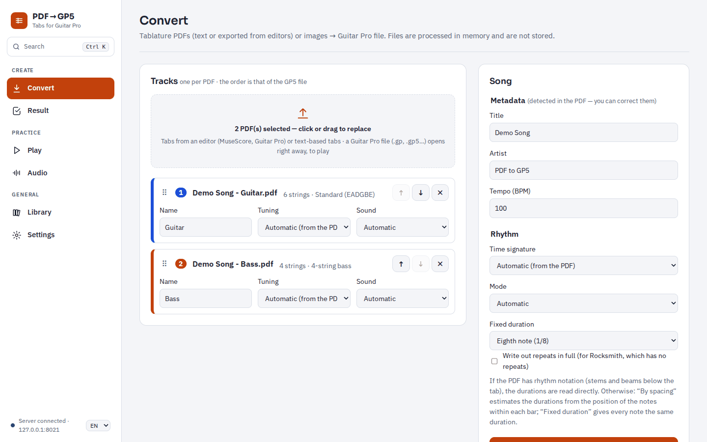
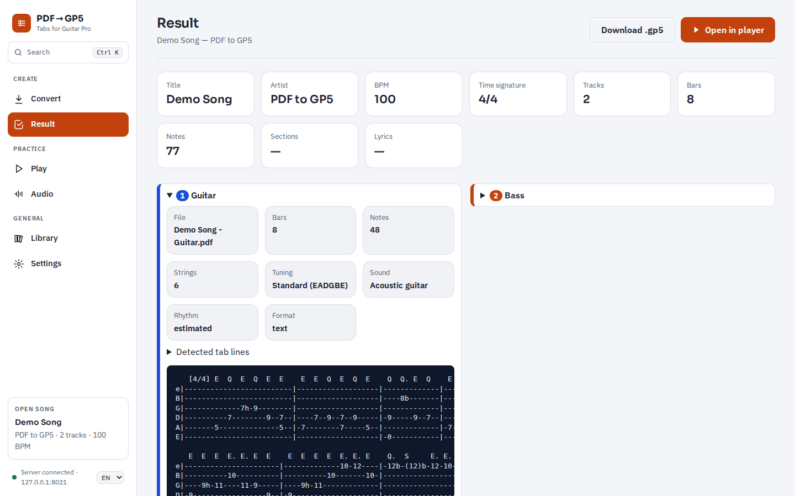
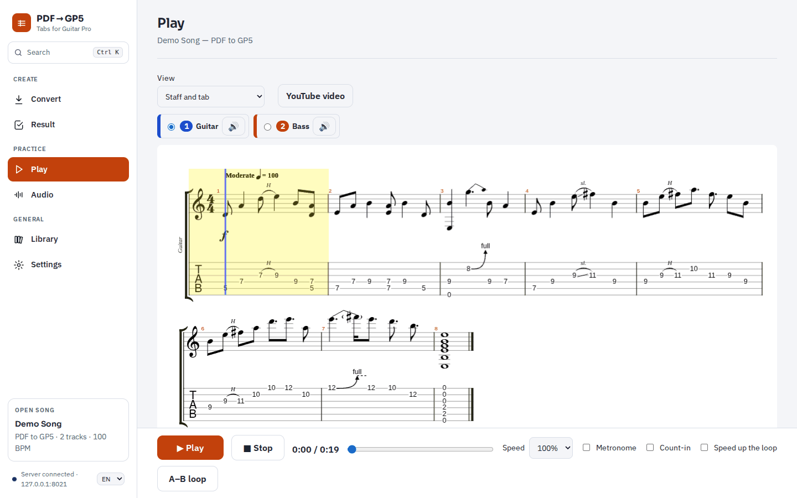
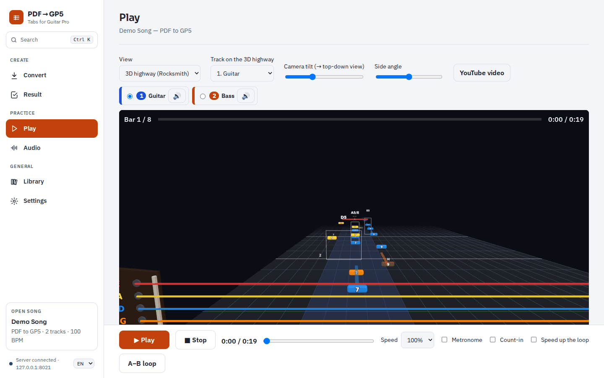
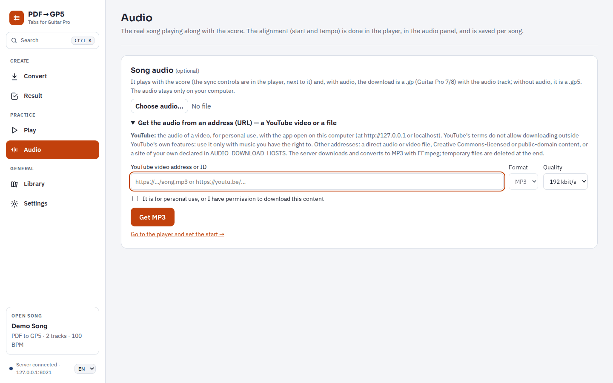
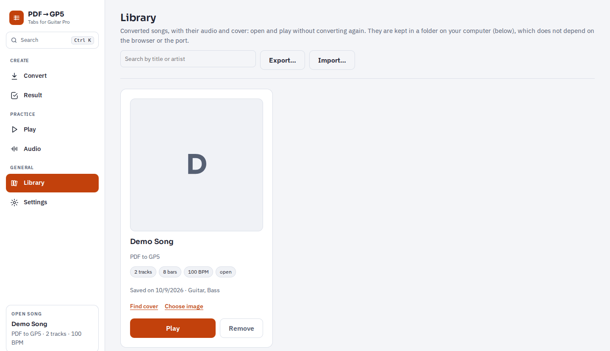

# PDF → GP5 user manual

[Português](MANUAL.md) · **English**

PDF → GP5 turns tablature PDFs (or pictures of tabs) into **Guitar Pro** files. You can then
practise them in the browser. The player shows the notation and plays it, and there is a
Rocksmith-style 3D highway, the song's audio and video in sync, a loop, a metronome and a library
of your songs.

The app runs **on your own computer**. PDFs and pictures are not sent to any service: the local
server reads them in memory.

## Contents

1. [What the app reads](#1-what-the-app-reads)
2. [Install and start](#2-install-and-start)
3. [First run: Settings](#3-first-run-settings)
4. [Convert a tab](#4-convert-a-tab)
5. [Result and download](#5-result-and-download)
6. [Play and practise](#6-play-and-practise)
7. [3D highway](#7-3d-highway)
8. [Song audio](#8-song-audio)
9. [YouTube video](#9-youtube-video)
10. [Library](#10-library)
11. [Keyboard shortcuts](#11-keyboard-shortcuts)
12. [Privacy and rights](#12-privacy-and-rights)
13. [Troubleshooting](#13-troubleshooting)
14. [Limitations](#14-limitations)

---

## 1. What the app reads

| File | Example | Support |
|---|---|---|
| Text tab | `e|--0--3h5--|` printed from a `.txt` file or a website | ✅ |
| Tab exported by an editor | PDF from Guitar Pro, MuseScore, TuxGuitar, Songsterr | ⚠️ experimental |
| Tab picture (OCR) | PNG, JPEG or WebP screenshot; scanned PDF or a PDF made only of pictures | ⚠️ experimental |
| Guitar Pro file | `.gp`, `.gpx`, `.gp5`, `.gp4`, `.gp3` | ✅ opens to play, without converting |

- **One track per PDF**, up to 7 (guitar, bass, …), for instruments with 4 to 8 strings.
- The app reads the title, artist, BPM, time signature and tuning from the PDF. You can correct them before converting.
- Rhythm notation (stems, beams, rests) is read when the PDF has it. Without it, the rhythm is estimated from the spacing of the notes.
- Techniques: hammer-on/pull-off, slides, bends, vibrato, muted notes, ghost notes, palm mute, let ring, repeats, alternate endings and D.C./D.S./Coda.
- Lyrics printed in the PDF go into the file on a track of their own, "Lyrics (vocals)".

The status of every note and technique is listed in [`NOTACAO.md`](NOTACAO.md) (in Portuguese).

## 2. Install and start

### Requirements

- **Python 3.11 or later** ([python.org](https://www.python.org/downloads/)). On Windows, tick "Add python.exe to PATH" in the installer.
- **Google Chrome** (recommended) or Edge. The 3D highway needs hardware acceleration (WebGL).
- **Git** (optional), to get updates with `git pull`.
- Internet only to install the app and for the online features: covers, YouTube video and audio from an address.

### Get the app

- With Git: `git clone https://github.com/F100Pilot/PDF-to-GP5.git`
- Without Git: on GitHub, choose **Code → Download ZIP** and extract the ZIP to a folder.

### Windows: double-click

The app folder has two scripts:

| Script | When to use it | Where the Python environment goes |
|---|---|---|
| `start.bat` | Personal PC, no restrictions | `.venv`, inside the app folder |
| `start_env.bat` | Work PC: no administrator rights, folder on OneDrive | `%USERPROFILE%\venvs\pdf-to-gp5` |

Double-click the script. The first run takes a few minutes because it installs the dependencies.
After that, the script:

1. Updates the code (`git pull`), if Git is installed.
2. Installs or updates the dependencies.
3. Opens the app in Chrome, in a window of its own, at `http://127.0.0.1:8021`.

**To quit**, just close the app window: the server stops about 8 seconds later. You can also press
Ctrl+C in the script window.

### macOS and Linux

```bash
cd PDF-to-GP5
python3 -m venv .venv
.venv/bin/pip install -r requirements.txt
.venv/bin/pip install --no-deps --ignore-requires-python -r requirements-ocr.txt
.venv/bin/python -m app --port 8021 --close-with-browser
```

Then open `http://127.0.0.1:8021` in your browser.

## 3. First run: Settings



Open **Settings** in the menu on the left.

- **Server status** shows what is available.
  - If a part is missing (OCR, audio from an address, YouTube), an **Install** button appears. It installs the missing packages, without administrator rights.
  - **Set up key** saves a YouTube API key. The app uses it only to find the song's video by itself. It is optional; see [section 9](#9-youtube-video).
- **Appearance**:
  - Theme: system, light or dark.
  - Language: Portuguese or English. By default the app follows the browser's language. The selector is also at the bottom of the menu.
- **Keyboard shortcuts** and **About**, with the installed version.

## 4. Convert a tab



1. In **Convert**, drag the PDFs onto the dashed area, or click it to choose them. Pictures work too.
   - Each file becomes a track. A progress bar shows each file being analysed.
2. Check each track:
   - **Name**.
   - **Tuning**: "Automatic (from the PDF)", or pick one (Drop D, Eb, …).
   - **Sound**: the MIDI instrument.
   - **Order**: the tracks go into the file in this order. Change it with the arrows, or drag the ⠿ handle. ✕ removes a track.
3. Under **Song**, check the **Title**, **Artist** and **Tempo (BPM)**. They are filled in with what was found in the PDF.
4. Under **Rhythm**:
   - **Time signature**: "Automatic (from the PDF)", or a fixed one (4/4, 6/8, …).
   - **Mode**:
     - *Automatic*: uses the rhythm notation when there is any, otherwise the spacing.
     - *By spacing*: estimates the durations from where the notes are in the bar.
     - *Fixed duration*: gives every note the same value.
   - **Write out repeats in full**: copies repeated bars in the order they are played. This helps with Rocksmith, which has no repeats.
5. Press **Convert**. The bar shows the progress. Tab pictures take longer, because every page is read by OCR.

### Tab pictures (OCR)

- For the best results, use the whole page, at least 1000 px wide.
- The OCR reads frets, string lines, bar lines, the drawn rhythm and the tuning letters.
- Bends, slides and ties drawn in a picture are not read.
- One picture is one track. To combine several screenshots of the same part, put them in one PDF.
- Always check the notes: the report warns you when something is uncertain.

### Open a Guitar Pro file

Choose or drop a `.gp`, `.gpx`, `.gp5`, `.gp4` or `.gp3` file on the same area. It opens straight
away, without converting, with the summary, notation, 3D highway, audio and video. It is also saved
in the library. Open one Guitar Pro file at a time.

## 5. Result and download



The **Result** page shows:

- A summary of the song: title, artist, BPM, time signature, tracks, bars, notes, sections and lyrics.
- **Warnings**: what was estimated or skipped and should be checked.
- The details of each track: file, strings, tuning, sound, rhythm and the format that was read. Open "Detected tab lines" to see a text preview.

To save the song:

- **Download .gp5** saves a Guitar Pro 5 file. It opens in Guitar Pro, TuxGuitar and Rocksmith converters.
- If you have chosen audio for the song, the download becomes a `.gp` file (Guitar Pro 7/8) that includes the audio (see [section 8](#8-song-audio)).

**Open in player** takes you to the Play page.

## 6. Play and practise



- **View**: *Staff and tab*, *Tab only*, *Staff only* or *3D highway (Rocksmith)*. Keys 1–4 also switch the view.
- **Tracks**: pick the track to show. Each track's 🔊 button mutes or unmutes it.
- **Click a note** to start playing from there.

The bar at the bottom is always visible:

- **Play / Stop**.
- **Time bar**: click or drag to move forward or back.
- **Sections** of the song (Intro, Verse, Chorus…), above the time bar when the PDF has them. Click one to jump there.
- **Speed**: 50 %, 75 %, 100 % or 125 %.
- **A–B loop**: press it once at the start of the passage and again at the end. Press it again to turn the loop off.
- **Metronome**: one click per beat, with the first beat of the bar accented.
- **Count-in**: one bar of clicks before playback starts. It is skipped while the song's audio or video plays along.
- **Speed up the loop**: with the A–B loop on, each pass is 5 % faster, from the chosen speed up to 100 %. You could start at 75 %, for example.

The metronome, count-in and loop choices are remembered by the browser.

## 7. 3D highway



Choose **3D highway (Rocksmith)** under View.

- **String colours** as in Rocksmith, with the low E in red at the top.
- Notes reach the strike line on the right fret.
- **Techniques** are drawn: bends, slides, hammer-ons/pull-offs (H/P), palm mute (PM), harmonics, vibrato, tapping and ghost notes.
- Chord names and the lyrics are shown, with the current syllable highlighted.
- **Track on the 3D highway**, **Camera tilt** and **Side angle** adjust the view.

With the mouse over the highway:

| Action | Effect |
|---|---|
| Drag | Turn the view around the strings, up to 120° on each axis |
| Ctrl + drag | Roll around the viewing axis |
| Shift + drag, or right button | Move the view |
| Mouse wheel | Zoom in or out, towards the cursor |
| Double-click | Reset the view |

If the computer has no hardware acceleration, the page says so and shows the notation instead (see
[Troubleshooting](#13-troubleshooting)).

## 8. Song audio



On the **Audio** page you can add the real recording of the song. It plays in sync with the notation
and the 3D highway.

- **Choose audio…**: an MP3, OGG or WAV file, up to 100 MB.
- **Get the audio from an address (URL)**: a YouTube video or an audio file.
  - The server converts it to MP3 and shows the progress.
  - You must tick "It is for personal use, or I have permission…".
  - **Save the MP3** saves the file on your computer. In Chrome/Edge, the save dialog opens in the PDFs' folder.

### Line up the audio with the notation

You line up the audio in the audio panel next to the notation, on the Play page:

1. Play the audio and press **Mark start** when you hear the first beat of bar 1.
2. If the notation runs early or late, fine-tune it with the ±0.01 s / ±0.1 s / ±1 s buttons, or the `[` and `]` keys.
3. If the notation drifts ahead or behind during the song, adjust the **Score tempo (BPM)**. The recording may not be exactly at the PDF's BPM.
4. Set the **Song volume** and the **Notes volume**.

These settings are saved per song. With audio, **Download** gives a `.gp` file (Guitar Pro 7/8) with the
audio as its audio track and a sync point at bar 1. The browser creates the file, so the audio never
leaves your computer.

## 9. YouTube video

The **YouTube video** button on the Play page shows the song's video next to the notation.

- The video follows Play, Pause, Stop and the notation's position and speed.
- **Mark start** and the ±0.1 s / ±1 s buttons line up where the song starts in the video.
- "Mute the score's sounds" lets you hear only the video.
- You can paste the address of another video.

**Automatic search (optional).** For the app to find the video by itself, it needs a free YouTube
Data API key:

1. At https://console.cloud.google.com, create a project.
2. Enable **YouTube Data API v3**.
3. Under **Credentials**, create an **API key**. Restricting it to that API is recommended.
4. Paste the key in **Settings → Set up key**.

The step-by-step guide, with screens, is [`CHAVE_YOUTUBE.md`](CHAVE_YOUTUBE.md) (in Portuguese).
Without a key, the panel offers **Search on YouTube**, which opens the search already filled in.

## 10. Library



Every song you convert or open is saved in a folder on your computer:

- By default: `PDF-to-GP5\Biblioteca` in your user folder (e.g. `C:\Users\<name>\PDF-to-GP5\Biblioteca`).
- Each song has a subfolder with the Guitar Pro file, the audio, the cover (`capa.jpg`) and `musica.json`.

On the **Library** page:

- **Play** reopens a song without converting it again, with its audio and alignment.
- **Remove** deletes only the app's files. Other files you put in the subfolder are kept.
- **Find cover** looks the album cover up in the public iTunes search; **Choose image** uses an image of your own.
- **Search by title or artist** filters the list.

Converting the same song again replaces its Guitar Pro file and keeps the audio and the cover.

### Move songs to another computer

1. On the source computer, press **Export…**, choose the songs and save the ZIP.
   - The ZIP carries each song's Guitar Pro file, cover and settings: audio start, tempo and YouTube video.
   - The audio (MP3) is not included.
2. On the other computer, press **Import…** and choose the ZIP.
3. Tick the songs to import.
   - Songs already in the library show both dates and which one is newer.
   - Such a song is only replaced if you tick **Replace the library's song**; its audio stays.

## 11. Keyboard shortcuts

| Key | Action |
|---|---|
| Space | Play / pause |
| ← → | Previous / next bar |
| 1 – 4 | View: staff and tab, tab only, staff only, 3D highway |
| `[` `]` | Delay / advance the score 0.1 s (with audio) |
| L | A–B loop |
| Ctrl K (⌘K on Mac) | Search pages, library songs and commands |

## 12. Privacy and rights

- PDFs and pictures are processed in memory on your computer. The server does not keep them.
- The OCR runs locally and sends nothing.
- Converted songs are kept only in the library folder.
- **Internet connections**: only to look up covers (iTunes), to search for and show the video (YouTube) and to fetch audio from an address you give.
- Use the app only with tabs and music you have the rights to. YouTube's terms do not allow
  downloading outside YouTube's own features. The YouTube audio option is meant for personal use
  and only works with the app open on the same computer.

## 13. Troubleshooting

| Problem | What to do |
|---|---|
| "Python não encontrado" (Python not found) when the script starts | Install Python 3.11+ from [python.org](https://www.python.org/downloads/) with "Add python.exe to PATH". |
| OCR, yt-dlp or FFmpeg is missing | Settings → Server status → **Install**. If it fails, the last lines from pip show why. |
| The 3D highway does not appear | Start the app with `start.bat` / `start_env.bat`: they turn on hardware acceleration in Chrome. In another browser, check that hardware acceleration is on. |
| "Processing the PDF exceeded the time limit." | This happens with very large PDFs read by OCR on a slow computer. Split the PDF, or use fewer pages. |
| Title or artist not detected | Type them into the fields before converting. |
| Wrong notes from a picture | Use a bigger picture (whole page, at least 1000 px wide) and check the notes. |
| A YouTube video gives no audio | The page shows the cause: private video, age restriction, a request to confirm you are not a robot, or a missing JavaScript runtime (use Install in Settings). |
| The video says it cannot be played outside YouTube | The owner does not allow it. Choose another video. |
| Port 8021 is in use | Change `PORT` at the top of `start.bat` / `start_env.bat`. The library stays the same. |

## 14. Limitations

- Text tabs set in a proportional (not monospaced) font have misaligned columns.
- Pictures: bends, slides, ties and tuplets drawn in a picture are not read, nor are section names. Text tabs inside a picture are not read either.
- Rhythm estimated from spacing is an approximation: check it in the notation.
- Spelled-out chords, rit./accel., quintuplets and septuplets are not converted exactly.
- One track per PDF, 7 tracks at most.

For technical details (API, configuration, security), see the [README](../README.md) (in Portuguese).
