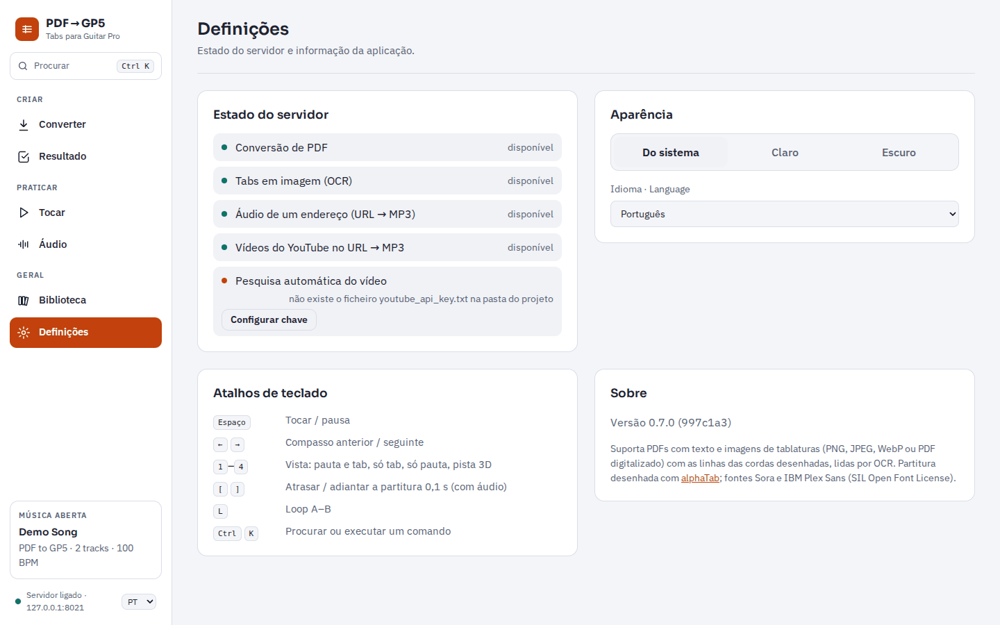
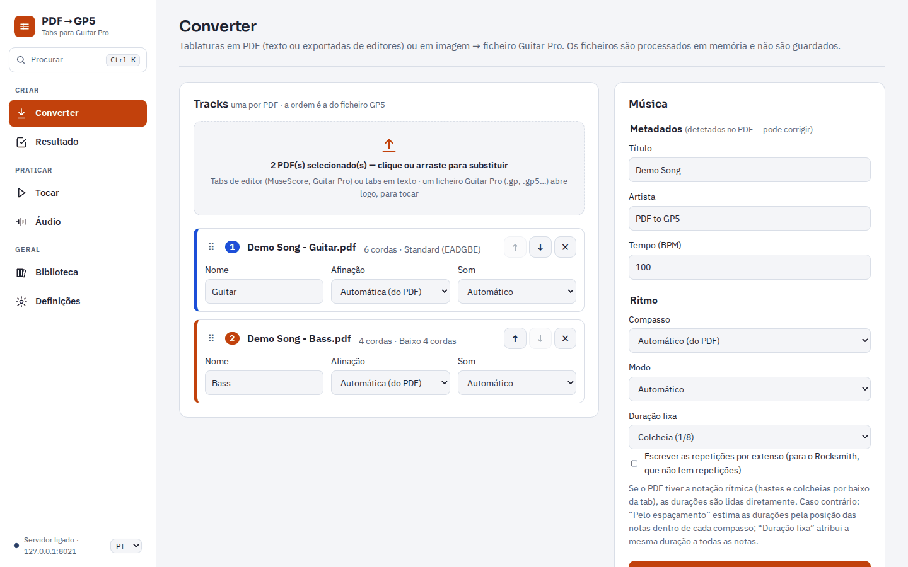
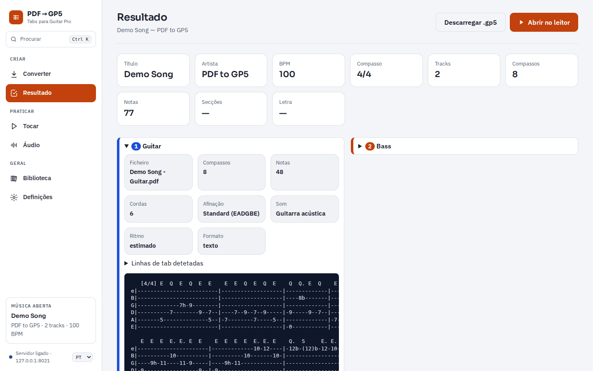
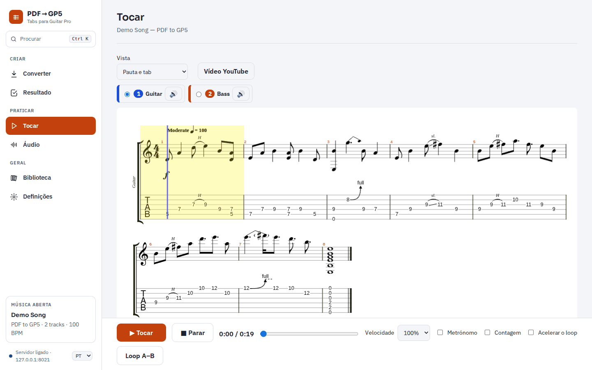
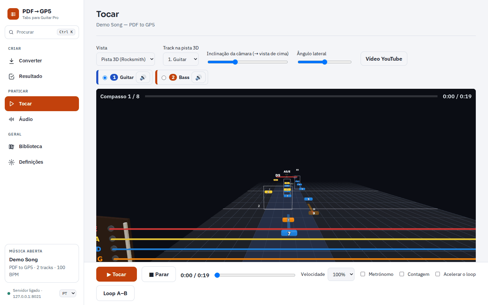
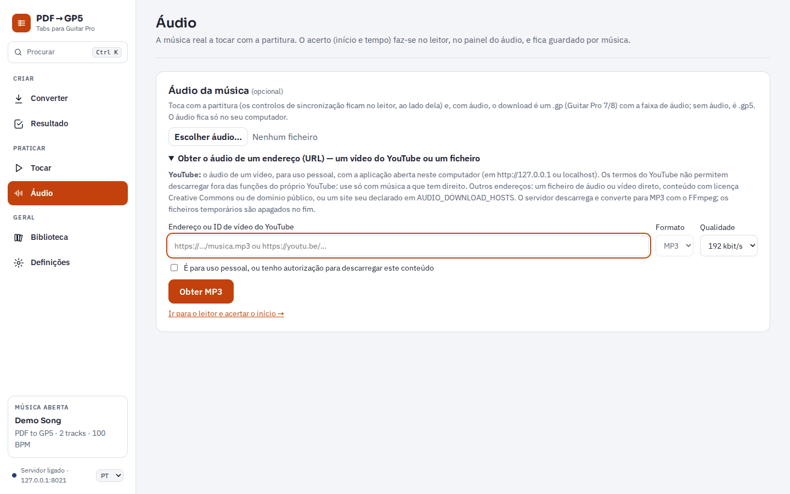
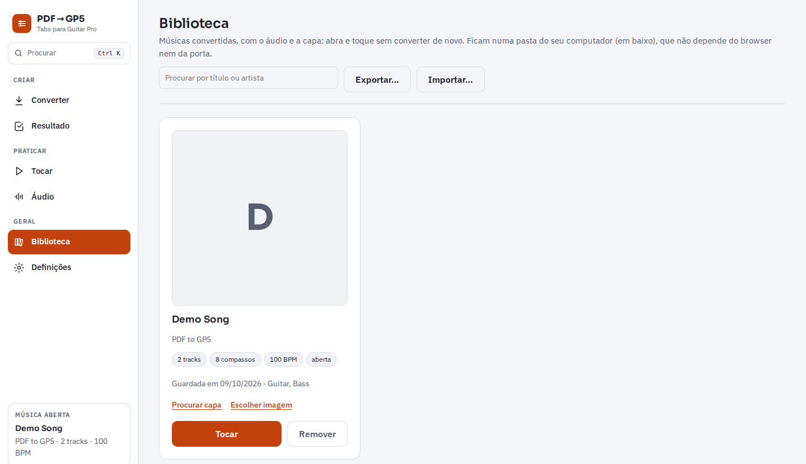

# Manual do PDF → GP5

**Português** · [English](MANUAL.en.md)

O PDF → GP5 transforma tablaturas em PDF (ou em imagem) em ficheiros **Guitar Pro** e deixa
praticá-las no browser: partitura que toca, pista 3D ao estilo do Rocksmith, áudio e vídeo da
música em sincronia, loop, metrónomo e uma biblioteca das suas músicas.

A aplicação corre **no seu computador**. Os PDFs e as imagens não são enviados para nenhum serviço:
são lidos pelo servidor local, em memória.

## Índice

1. [O que a aplicação lê](#1-o-que-a-aplicação-lê)
2. [Instalar e abrir](#2-instalar-e-abrir)
3. [Primeira utilização: Definições](#3-primeira-utilização-definições)
4. [Converter uma tab](#4-converter-uma-tab)
5. [Resultado e download](#5-resultado-e-download)
6. [Tocar e praticar](#6-tocar-e-praticar)
7. [Pista 3D](#7-pista-3d)
8. [Áudio da música](#8-áudio-da-música)
9. [Vídeo do YouTube](#9-vídeo-do-youtube)
10. [Biblioteca](#10-biblioteca)
11. [Atalhos de teclado](#11-atalhos-de-teclado)
12. [Privacidade e direitos](#12-privacidade-e-direitos)
13. [Resolução de problemas](#13-resolução-de-problemas)
14. [Limitações](#14-limitações)

---

## 1. O que a aplicação lê

| Ficheiro | Exemplo | Suporte |
|---|---|---|
| Tab em texto | `e|--0--3h5--|` impresso de um `.txt` ou de um site | ✅ |
| Tab exportada por um editor | PDF do Guitar Pro, MuseScore, TuxGuitar, Songsterr | ⚠️ experimental |
| Tab em imagem (OCR) | Print/screenshot PNG, JPEG ou WebP; PDF digitalizado ou só com imagens | ⚠️ experimental |
| Ficheiro Guitar Pro | `.gp`, `.gpx`, `.gp5`, `.gp4`, `.gp3` | ✅ abre para tocar, sem converter |

- **Uma track por PDF**, até 7 (guitarra, baixo, …). Instrumentos de 4 a 8 cordas.
- O título, o artista, o BPM, o compasso e a afinação são lidos do PDF. Pode corrigi-los antes de converter.
- O ritmo desenhado (hastes, barras, pausas) é lido quando existe. Sem ele, é estimado pelo espaçamento das notas.
- Técnicas: hammer-on/pull-off, slides, bends, vibrato, notas abafadas, ghost notes, palm mute, let ring, repetições, voltas e D.C./D.S./Coda.
- A letra impressa vai para o ficheiro numa track própria, "Letra (voz)".

O estado de cada nota e técnica está em [`NOTACAO.md`](NOTACAO.md).

## 2. Instalar e abrir

### O que é preciso

- **Python 3.11 ou mais recente** ([python.org](https://www.python.org/downloads/)). No Windows, marque "Add python.exe to PATH" no instalador.
- **Google Chrome** (recomendado) ou Edge. A pista 3D precisa de aceleração gráfica (WebGL).
- **Git** (opcional). Serve para receber atualizações com `git pull`.
- Internet só na instalação e para as funções online: capas, vídeo do YouTube e áudio de um endereço.

### Obter a aplicação

- Com Git: `git clone https://github.com/F100Pilot/PDF-to-GP5.git`
- Sem Git: no GitHub, **Code → Download ZIP**, e extraia o ZIP para uma pasta.

### Windows: duplo clique

Na pasta da aplicação há dois scripts:

| Script | Quando usar | Onde fica o ambiente Python |
|---|---|---|
| `start.bat` | PC pessoal, sem restrições | `.venv`, dentro da pasta da aplicação |
| `start_env.bat` | PC de trabalho: sem administrador, pasta no OneDrive | `%USERPROFILE%\venvs\pdf-to-gp5` |

Faça duplo clique no script. Da primeira vez demora alguns minutos, porque instala as dependências.
Depois:

1. Atualiza o código (`git pull`), se o Git estiver instalado.
2. Instala ou atualiza as dependências.
3. Abre a aplicação no Chrome, numa janela própria, em `http://127.0.0.1:8021`.

**Para fechar**, basta fechar a janela da aplicação: o servidor encerra cerca de 8 segundos depois.
Também pode carregar em Ctrl+C na janela do script.

### macOS e Linux

```bash
cd PDF-to-GP5
python3 -m venv .venv
.venv/bin/pip install -r requirements.txt
.venv/bin/pip install --no-deps --ignore-requires-python -r requirements-ocr.txt
.venv/bin/python -m app --port 8021 --close-with-browser
```

Depois abra `http://127.0.0.1:8021` no browser.

## 3. Primeira utilização: Definições



Abra **Definições** no menu à esquerda.

- **Estado do servidor**: mostra o que está disponível.
  - Se faltar alguma parte (OCR, áudio de um endereço, YouTube), aparece o botão **Instalar**. Instala os pacotes em falta, sem administrador.
  - **Configurar chave**: guarda a chave da API do YouTube, usada só para encontrar o vídeo da música automaticamente. É opcional; veja a [secção 9](#9-vídeo-do-youtube).
- **Aparência**:
  - Tema: do sistema, claro ou escuro.
  - Idioma: português ou inglês. Por defeito segue o idioma do browser; o seletor também está no fundo do menu.
- **Atalhos de teclado** e **Sobre**, com a versão instalada.

## 4. Converter uma tab



1. Em **Converter**, arraste os PDFs para a zona tracejada ou clique nela para os escolher. Também aceita imagens.
   - Cada ficheiro é uma track. A barra de progresso mostra a análise de cada um.
2. Confira cada track:
   - **Nome**.
   - **Afinação**: "Automático (do PDF)" ou escolha uma (Drop D, Eb, …).
   - **Som**: o instrumento MIDI.
   - **Ordem**: a ordem das tracks é a do ficheiro final. Mude-a com as setas ou arrastando pela pega ⠿. O ✕ remove a track.
3. Em **Música**, confira o **Título**, o **Artista** e o **Tempo (BPM)**. São preenchidos com o que foi detetado no PDF.
4. Em **Ritmo**:
   - **Compasso**: "Automático (do PDF)" ou um fixo (4/4, 6/8, …).
   - **Modo**:
     - *Automático*: usa o ritmo desenhado se existir; senão, o espaçamento.
     - *Pelo espaçamento*: estima as durações pela posição das notas no compasso.
     - *Duração fixa*: todas as notas com a mesma figura.
   - **Escrever as repetições por extenso**: copia os compassos repetidos pela ordem em que se tocam. É útil para o Rocksmith, que não tem repetições.
5. Carregue em **Converter**. A barra mostra o progresso. As tabs em imagem demoram mais, porque cada página é lida por OCR.

### Tabs em imagem (OCR)

- O melhor resultado é com a página inteira, a 1000 px de largura ou mais.
- O OCR lê os números, as linhas das cordas, as barras de compasso, o ritmo desenhado e as letras da afinação.
- Os bends, os slides e as ligaduras desenhados numa imagem não são lidos.
- Uma imagem é uma track. Para juntar vários prints da mesma parte, ponha-os num único PDF.
- Confira sempre as notas: o relatório avisa quando algo é incerto.

### Abrir um ficheiro Guitar Pro

Escolha ou arraste um `.gp`, `.gpx`, `.gp5`, `.gp4` ou `.gp3` para a mesma zona. Abre logo, sem
conversão, com o resumo, a partitura, a pista 3D, o áudio e o vídeo. Fica também guardado na biblioteca.
Abre-se um ficheiro Guitar Pro de cada vez.

## 5. Resultado e download



A página **Resultado** mostra:

- O resumo da música: título, artista, BPM, compasso, tracks, compassos, notas, secções e letra.
- Os **avisos**: o que foi estimado ou ignorado e deve ser conferido.
- Os detalhes de cada track: ficheiro, cordas, afinação, som, ritmo e formato lido. Abra "Linhas de tab detetadas" para ver a pré-visualização em texto.

Para guardar a música:

- **Descarregar .gp5** guarda o ficheiro Guitar Pro 5, que abre no Guitar Pro, no TuxGuitar e em conversores para o Rocksmith.
- Se escolheu um áudio para a música, o download passa a ser um `.gp` (Guitar Pro 7/8) com o áudio incluído (veja a [secção 8](#8-áudio-da-música)).

**Abrir no leitor** leva à página Tocar.

## 6. Tocar e praticar



- **Vista**: *Pauta e tab*, *Só tab*, *Só pauta* ou *Pista 3D (Rocksmith)*. As teclas 1–4 também mudam a vista.
- **Tracks**: escolha a track a mostrar. O botão 🔊 de cada track silencia-a ou volta a ligá-la.
- **Clique numa nota** para começar a tocar a partir daí.

A barra em baixo fica sempre visível:

- **Tocar / Parar**.
- **Barra de tempo**: clique ou arraste para avançar ou recuar.
- **Secções** da música (Intro, Verse, Chorus…) por cima da barra de tempo, quando o PDF as tem. Clique numa para saltar para lá.
- **Velocidade**: 50 %, 75 %, 100 % ou 125 %.
- **Loop A–B**: carregue uma vez no início do trecho e outra no fim; carregue outra vez para desligar.
- **Metrónomo**: um clique em cada tempo, com acento no primeiro do compasso.
- **Contagem**: um compasso de cliques antes de começar. Não toca quando o áudio ou o vídeo da música estão a acompanhar.
- **Acelerar o loop**: com o Loop A–B ligado, cada volta fica 5 % mais rápida, desde a velocidade escolhida até 100 %. Comece, por exemplo, a 75 %.

As escolhas do metrónomo, da contagem e do loop ficam guardadas no browser.

## 7. Pista 3D



Escolha **Pista 3D (Rocksmith)** em Vista.

- **Cores das cordas** como no Rocksmith: Mi grave a vermelho, em cima.
- As notas chegam à linha de ataque no traste certo.
- **Desenho das técnicas**: bends, slides, hammer-on/pull-off (H/P), palm mute (PM), harmónicos, vibrato, tapping e ghost notes.
- Mostra o nome dos acordes e a letra, com a sílaba atual.
- **Track na pista 3D**, **Inclinação da câmara** e **Ângulo lateral** ajustam a vista.

Com o rato sobre a pista:

| Ação | Efeito |
|---|---|
| Arrastar | Rodar a vista à volta das cordas, até 120° em cada eixo |
| Ctrl + arrastar | Rodar sobre o eixo da vista |
| Shift + arrastar, ou botão direito | Mover a vista |
| Roda do rato | Aproximar ou afastar, na direção do cursor |
| Duplo clique | Repor a vista |

Se o computador não tiver aceleração gráfica, a página avisa e mostra a partitura (veja
[Resolução de problemas](#13-resolução-de-problemas)).

## 8. Áudio da música



Na página **Áudio** pode juntar a gravação real da música, que toca em sincronia com a partitura e com a pista 3D:

- **Escolher áudio…**: um ficheiro MP3, OGG ou WAV, até 100 MB.
- **Obter o áudio de um endereço (URL)**: um vídeo do YouTube ou um ficheiro de áudio.
  - O servidor converte-o para MP3 e mostra o progresso.
  - Tem de marcar "É para uso pessoal, ou tenho autorização…".
  - **Guardar o MP3** grava o ficheiro no computador. No Chrome/Edge, abre o diálogo de gravação já na pasta dos PDFs.

### Acertar o áudio com a partitura

O acerto faz-se no painel do áudio, ao lado da partitura, na página Tocar:

1. Toque o áudio e carregue em **Marcar início** quando ouvir o primeiro tempo do compasso 1.
2. Se a partitura for adiantada ou atrasada, afine com os botões ±0,01 s / ±0,1 s / ±1 s, ou com as teclas `[` e `]`.
3. Se a partitura se for adiantando ou atrasando ao longo da música, ajuste o **Tempo da partitura (BPM)**. A gravação pode não estar exatamente ao BPM do PDF.
4. Regule o **Volume da música** e o **Volume das notas**.

O acerto fica guardado por música. Com áudio, **Descarregar** dá um `.gp` (Guitar Pro 7/8) com o
áudio como faixa de áudio e o ponto de sincronização no compasso 1. O ficheiro é criado no browser,
e o áudio não sai do computador.

## 9. Vídeo do YouTube

O botão **Vídeo YouTube**, na página Tocar, mostra o vídeo da música ao lado da partitura.

- Acompanha Tocar, Pausa, Parar, a posição e a velocidade da partitura.
- **Marcar início** e os botões ±0,1 s / ±1 s acertam o início da música no vídeo.
- "Silenciar os sons da partitura" deixa ouvir só o vídeo.
- Pode colar o endereço de outro vídeo.

**Pesquisa automática (opcional).** Para a aplicação encontrar o vídeo sozinha, precisa de uma
chave gratuita da YouTube Data API. Crie-a seguindo o guia [`CHAVE_YOUTUBE.md`](CHAVE_YOUTUBE.md) e
cole-a em **Definições → Configurar chave**. Sem chave, o painel tem "Procurar no YouTube", que abre a
pesquisa já preenchida.

## 10. Biblioteca



Cada música convertida ou aberta fica guardada numa pasta do computador:

- Por defeito: `PDF-to-GP5\Biblioteca`, na pasta do utilizador (ex.: `C:\Users\<nome>\PDF-to-GP5\Biblioteca`).
- Cada música tem uma subpasta, com o ficheiro Guitar Pro, o áudio, a capa (`capa.jpg`) e `musica.json`.

Na página **Biblioteca**:

- **Tocar** reabre a música sem converter, com o áudio e o acerto.
- **Remover** apaga só os ficheiros da aplicação. Outros ficheiros que tenha posto na subpasta ficam.
- **Procurar capa** procura a capa do álbum na pesquisa pública do iTunes; **Escolher imagem** usa uma imagem sua.
- **Procurar por título ou artista** filtra a lista.

Converter a mesma música outra vez substitui o ficheiro Guitar Pro e mantém o áudio e a capa.

### Levar músicas para outro computador

1. No computador de origem, carregue em **Exportar…**, escolha as músicas e guarde o ZIP.
   - O ZIP leva o ficheiro Guitar Pro, a capa e as definições de cada música: início do áudio, tempo e vídeo do YouTube.
   - O áudio (MP3) não vai no ZIP.
2. No outro computador, carregue em **Importar…** e escolha o ZIP.
3. Marque as músicas a importar.
   - As que já existem mostram as duas datas e qual é a mais recente.
   - Uma música que já existe só é substituída se marcar **Substituir a música da biblioteca**; o áudio dela fica.

## 11. Atalhos de teclado

| Tecla | Ação |
|---|---|
| Espaço | Tocar / pausa |
| ← → | Compasso anterior / seguinte |
| 1 – 4 | Vista: pauta e tab, só tab, só pauta, pista 3D |
| `[` `]` | Atrasar / adiantar a partitura 0,1 s (com áudio) |
| L | Loop A–B |
| Ctrl K (⌘K no Mac) | Procurar páginas, músicas da biblioteca e comandos |

## 12. Privacidade e direitos

- Os PDFs e as imagens são processados em memória, no seu computador, e não são guardados pelo servidor.
- O OCR corre localmente e não envia nada.
- As músicas convertidas ficam só na pasta da biblioteca.
- **Ligações à internet**: só para procurar capas (iTunes), pesquisar e mostrar o vídeo (YouTube) e obter áudio de um endereço que indicar.
- Use a aplicação só com tabs e música a que tem direito. Os termos do YouTube não permitem descarregar
  fora das funções do próprio YouTube. A opção de áudio do YouTube destina-se a uso pessoal e só
  funciona com a aplicação aberta no próprio computador.

## 13. Resolução de problemas

| Problema | O que fazer |
|---|---|
| "Python não encontrado" ao abrir o script | Instale o Python 3.11+ de [python.org](https://www.python.org/downloads/) com "Add python.exe to PATH". |
| Falta o OCR, o yt-dlp ou o FFmpeg | Definições → Estado do servidor → **Instalar**. Se falhar, as últimas linhas do pip mostram o motivo. |
| A pista 3D não aparece | Abra a aplicação pelo `start.bat` / `start_env.bat`: eles ligam a aceleração gráfica no Chrome. Noutro browser, confirme que a aceleração por hardware está ligada. |
| "O processamento do PDF excedeu o tempo limite." | Acontece com PDFs muito grandes lidos por OCR num computador lento. Divida o PDF ou use imagens com menos páginas. |
| O título ou o artista não foram detetados | Escreva-os nos campos antes de converter. |
| As notas de uma imagem estão erradas | Use uma imagem maior (página inteira, ≥ 1000 px de largura) e confira as notas. |
| Um vídeo do YouTube não dá áudio | A página mostra a causa: vídeo privado, restrição de idade, pedido para confirmar que não é um robô, ou falta o runtime JavaScript (Instalar em Definições). |
| O vídeo diz que não pode ser visto fora do YouTube | O dono do vídeo não o permite. Escolha outro vídeo. |
| A porta 8021 está ocupada | Mude `PORT` no topo do `start.bat` / `start_env.bat`. A biblioteca não muda. |

## 14. Limitações

- Tabs em texto com fonte proporcional (não monoespaçada) desalinham as colunas.
- Nas imagens não são lidos os bends, os slides, as ligaduras nem as quiálteras desenhados, nem os nomes das secções. Tab em texto numa imagem também não é lida.
- O ritmo estimado pelo espaçamento é uma aproximação: confira-o na partitura.
- Acordes por extenso, rit./accel. e quintinas/septinas não são convertidos com exatidão.
- Uma track por PDF, no máximo 7 tracks.

Para os detalhes técnicos (API, configuração, segurança), veja o [README](../README.md).
